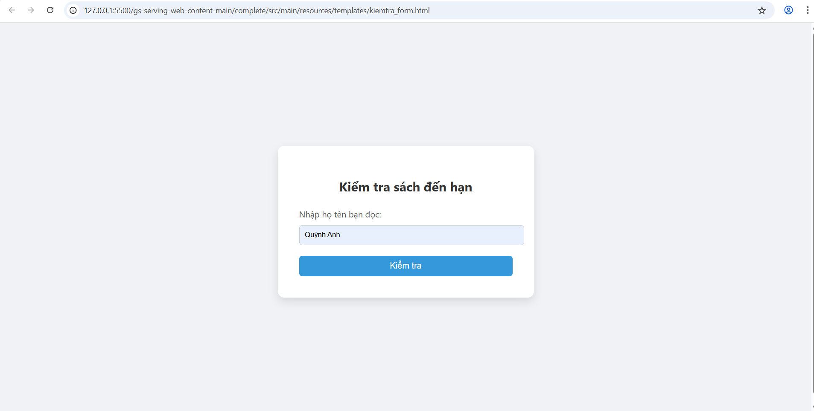

# Quan ly thu vien sach 

# 03 đối tượng


## Các đối tượng quản lý sách  : 
```
class Book {
  String id;
  String title;
  String author;
  String category;  
}


class Librarian {
  String id;
  String name;
  String email;
  String phoneNumber;
}

class User {
  String id;
  String name;
  String email;
  String role; 
}
```


## Folder Source Code của Project: 
```
src (
    Book.java 
    User.java
    Admin.java)
test (
    BookTest.java
    AdminTest.java
    UserTest.java)
README.md
```


Chương trình chính App.java (Main Program)
```
public class App {
    public static void main(String[] args){
        System.out.println("test main");

        ex21_QA.test();
        TestEx3_QA.test();

    }
}

```
# Chi tiết kiểu mô tả của các đối tượng
```
public class Admin {
    String adminId;
    String name;

    public Admin(String adminId, String name) {
        this.adminId = adminId;
        this.name = name;
    }

    public void addBook(Book book) {
        System.out.println("Admin " + name + " thêm sách: " + book.title);
    }

    public void removeBook(Book book) {
        System.out.println("Admin " + name + "  xóa sách: " + book.title);
    }
}

public class User {
    String id;
    String name; 
    String email;

    public User(String id, String name, String email) {
        this.id = id;
        this.name = name;
        this.email = email;
    }

    public void Info() {
        System.out.println("ID: " + id);
        System.out.println("Tên người dùng: " + name);
        System.out.println("Email: " + email);
    }
}

public class Book {
    String bookId;
    String title;
    String author;

    public Book(String bookId, String title, String author) {
        this.bookId = bookId;
        this.title = title;
        this.author = author;
    }

    public void displayBook() {
        System.out.println("Mã sách: " + bookId);
        System.out.println("Tên sách: " + title);
        System.out.println("Tác giả: " + author);
    }
}
```
## Kiểm định (test)
```
public class TestEx3_QA {

    // bien

    // phuongthuc

    public static void test() {

        ex3_QA obj = new ex3_QA();

        System.out.println("test khoi tao object kieu ex3_QA"+obj);
        User u = new User("id01", "Quynh Anh", "qa@gmail.com");
        u.Info();
    }

}

```
## Class Diagram


## thêm sách
public class Book {
    String title;
    String author;
    int year;
    
    public Book(String title, String author, int year) {
        this.title = title;
        this.author = author;
        this.year = year;
    }
}

import java.util.ArrayList;
public class BookList {
    ArrayList<Book> books = new ArrayList<>();

    public ArrayList<Book> addBook(Book book) {
        books.add(book);
        return books;
    }
}
## activity datagram 


## 3 phương thức hoạt động chính 
    + Tìm kiếm sách 
    + Cho mượn sách 
    + Thêm sách

## Miêu tả phương thức 
public MuonSach(String maSach, String maThanhVien, String ngayMuon, String ngayHetHan)
//Phương thức getMaSach
public String getMaSach()   

//Phương thức getMaThanhVien
public String getMaThanhVien()  

 //Phương thức getNgayMuon
public String getNgayMuon()    

//Phương thức getNgayHetHan
public String getNgayHetHan()  

 //Phương thức setNgayHetHan
public void setNgayHetHan(String ngayHetHan)   

 //Phương thức toString
public String toString()                       

## Sơ đồ thuật toán 


## Giao diện kiểm tra



## Tạo phiếu


